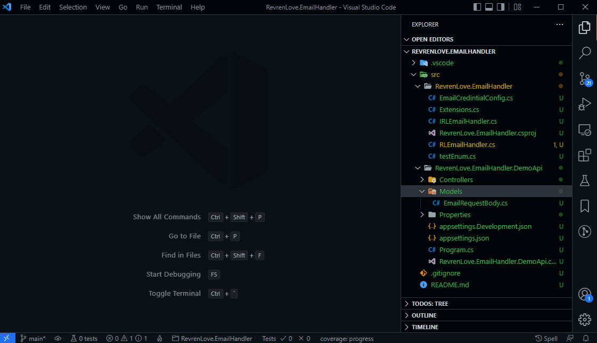
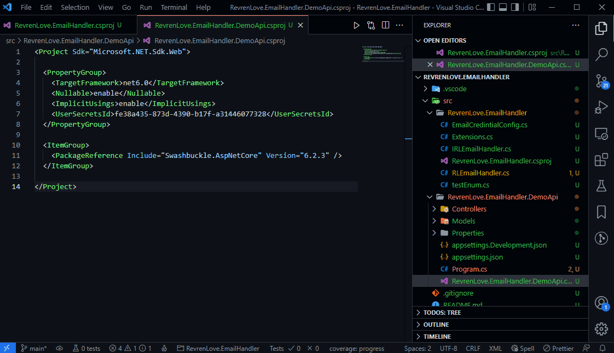

# C# Utilities

_That "other" blue soda can, when you already have a red can and a blue can to choose from._

## 🎉 **v1.0.0 NOW AVAILABLE!!!** 🎉

_versions 0.6.0 - 0.7.34 were busted... yeah, sorry about that_ :(

This extension provides some helpful features to _hopefully_ speed up your workflow when developing .net applications in VSCode.

Features currently include:

- Adding a class/interface/etc from the Explorer side bar
- Managing project references
- Not collecting any data.

## Features

### Add C# Item

Add a new C# file from the Explorer view.

This menu is available when you right-click a `.cs` file, a `.csproj` file, or a folder.

Currently the following types of items are supported:

- Class
- Interface
- Record
- Enum
- Struct

#### **Note: When Adding an Item**

- If you attempt to add an item by right-clicking a file/directory that is **not** inside a directory that contains a `.csproj` file (or subdirectory thereof), you will be alerted as such.

- The namespace is derived from either the `Project -> PropertyGroup -> RootNamespace` element in the `.csproj` file (if specified) or the project name. The namespace will have sub-namespacing that respects the folder tree.

  - If multiple `PropertyGroup` elements exist in the `.csproj` file with differing `RootNamespace` values, it will defer to the project name.

### Manage Project References

Right-clicking a `.csproj` file gives your the option to "Manage Project References..." which will open a menu showing all available projects in the workspace, with the ones already referenced being checked.

Simply check the projects you wish to reference and uncheck the ones you don't.

#### **Note: When Managing Project References**

- If a circular reference would be created from this action, an error will be displayed and it will be aborted.

- This feature does not manually edit the `.csproj` file - it actually executes the commands in an integrated terminal instance. So, if things do not go as you expect, check your integrated terminal named `dotnet` for any weirdness, and, please, feel free to [file an issue](https://github.com/revrenlove/CSharpUtilities/issues/new).

## Requirements

- Visual Studio Code v1.65.0 or higher.
- .NET 5+ or .NET Core SDK

## Upcoming Features

- Ability to add/remove C# projects.
- Project reference tree view
- Option for C#10 syntax features in new item templates

## To answer the question... "Why?"

There are several popular extensions available that attempt to achieve what this extension attempts to achieve... I just haven't found one that ticks the following boxes:

- Actively maintained
- Bug-free
- Lightweight
- Not trying to do "too much"

So, I decided I'll make my own C# extension... [with blackjack... and hookers](https://knowyourmeme.com/memes/im-going-to-build-my-own-theme-park-with-blackjack-and-hookers).\*

\* Blackjack and hookers not included.

## Telemetry/Privacy

This extension collects no data from anything. Every release of this extension is from source code publicly available. The only insight into metrics the developers or anyone have are the download numbers on the [marketplace page](https://marketplace.visualstudio.com/items?itemName=revrenlove.c-sharp-utilities) and any [issues](https://github.com/revrenlove/CSharpUtilities/issues) or [discussions](https://github.com/revrenlove/CSharpUtilities/discussions) that users create on the [github repo](https://github.com/revrenlove/CSharpUtilities).

I cannot speak on behalf of the packages utilized in this extension :

- [fast-xml-parser](https://www.npmjs.com/package/fast-xml-parser)
- [inversify](https://www.npmjs.com/package/inversify)
- [reflect-metadata](https://www.npmjs.com/package/reflect-metadata)
- [util](https://www.npmjs.com/package/util)
- [ts-md5](https://www.npmjs.com/package/ts-md5)

## [Issues](https://github.com/revrenlove/CSharpUtilities/issues)

Check the [bugs](https://github.com/revrenlove/CSharpUtilities/labels/bug) for things that may actually impact functionality.

Please, don't hesitate to [file an issue](https://github.com/revrenlove/CSharpUtilities/issues/new).

## Release Notes

### 1.0.0

- Disallowing project references with circular references
- DevOps infrastructure
- Fixed issue where the extension basically didn't work from v0.6.0 on
- Code cleanup/optimization/documentation

### 0.3.1

- Added feature to manage project references.
- Code cleanup & documentation updating.

### 0.1.0

This is the inaugural release of this extension. I'm sure there are bugs, and I've filed several issues so far regarding future plans for this extension.

## [Contributing](https://github.com/revrenlove/CSharpUtilities/blob/main/CONTRIBUTING.md)

Yeah, click that link above... Still sorting this part out. I'm just a one-man operation.
